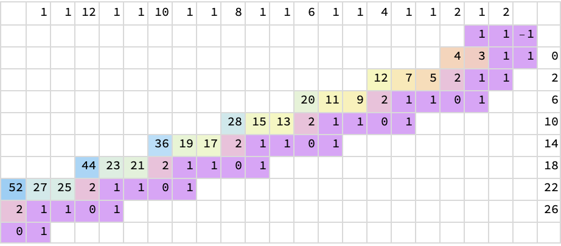

In 1972, mathematician Bill Gospher described an ingenious method for performing arithmetic on continued fractions (see [here](https://perl.plover.com/classes/cftalk/INFO/gosper.html) for his original publication). This repo provides a Python implementation, and [an article](https://hsinhaoyu.github.io/cont_frac/) to explain the logic.

### About the source code
The code was written as an exercise in [literate programming](https://en.wikipedia.org/wiki/Literate_programming). The Python code was written as parts of an [article](https://en.wikipedia.org/wiki/Literate_programming), using the [orgmode](https://orgmode.org) markup, which is popular among Emacs users. The main article is in the `org/` directory. The Python code blocks can be extracted from the `.org` files, and assembled into normal Python code in `src/`. In Emacs, this process is done with the `org-html-export-to-html` command. On a computer with Emacs installed, you can also run `make tangle`.

